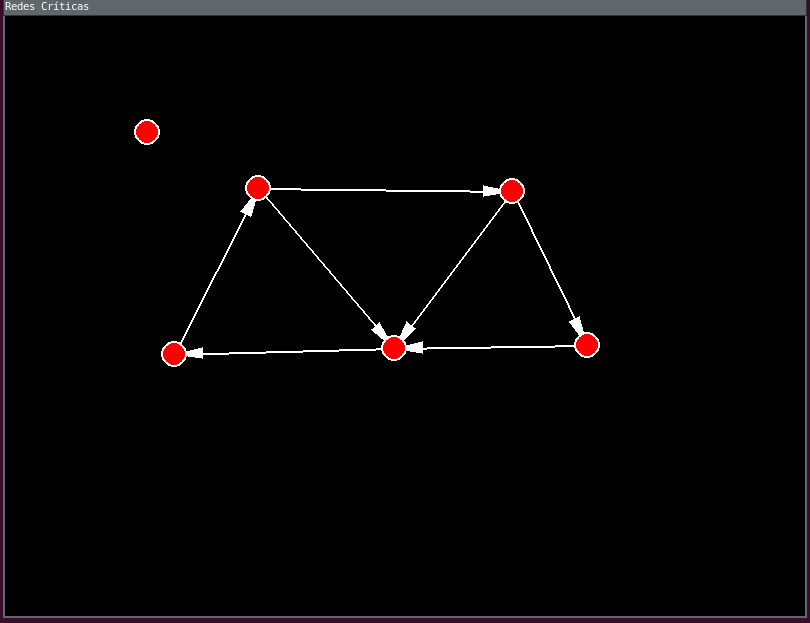
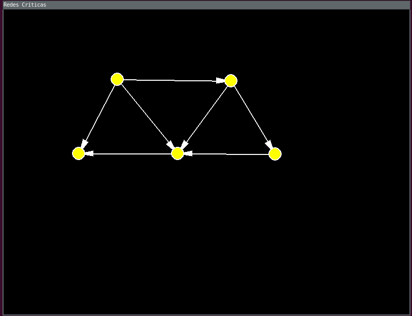

# Grafos1_redes_criticas

**Número da Lista**: 23<br>
**Conteúdo da Disciplina**: Grafos 1<br>

## Alunos
|Matrícula | Aluno |
| -- | -- |
| 19/0055006  |  Gian Medeiros Rosa |
| 20/0073249  |  Pedro Vitor Augusto de Jesus |

## Sobre 
O objetivo do projeto é identificar analizes impressissa em um sistema de rede de computadores. O sistema vai representar uma rede de computadores, com os computadores sendo seus nós e o cabeamento sendo as arestas que vão conectar conectar dois computadores.

<p>Após a representação do sistema em um grafo, será utilizado uma série de algoritmos para analisar a importância que a analise iniciada de cada nó e aresta tem para com a integridade do sistema como um todo.


Links de apresentação: 

- Parte 1 - [front](https://youtu.be/-COldQOxLIA)
- Parte 2 - [back](https://youtu.be/DCy5U93yEOU)

<!-- <iframe width="560" height="315" src="files/videos/apresentacao.mp4" frameborder="0" allow="accelerometer; autoplay; clipboard-write; encrypted-media; gyroscope; picture-in-picture" allowfullscreen></iframe> -->

## Screenshots

- Grafo **NÃO** é fortemente conectado e **NÃO GERA** engano de analise:



- Grafo **NÃO** é fortemente conectado e gera engano de analise:



- Grafo **É** fortemente conectado e **NÃO GERA** engano de analise:


## Instalação 
**Linguagem**: Python<br>
**Framework**: Pygame<br>

## Uso 

### Assegure ter o Python instalado em sua máquina

### Crie um ambiente virtual
```bash
python -m venv .venv
```

### Ative o ambiente virtual
```bash
# Linux
source .venv/bin/activate
```

```bash
# Windows
.venv\Scripts\activate
```

### Instale as dependências
```bash
pip install -r requirements.txt
```

### Execute o projeto
```bash
python main.py
```

## Outros


